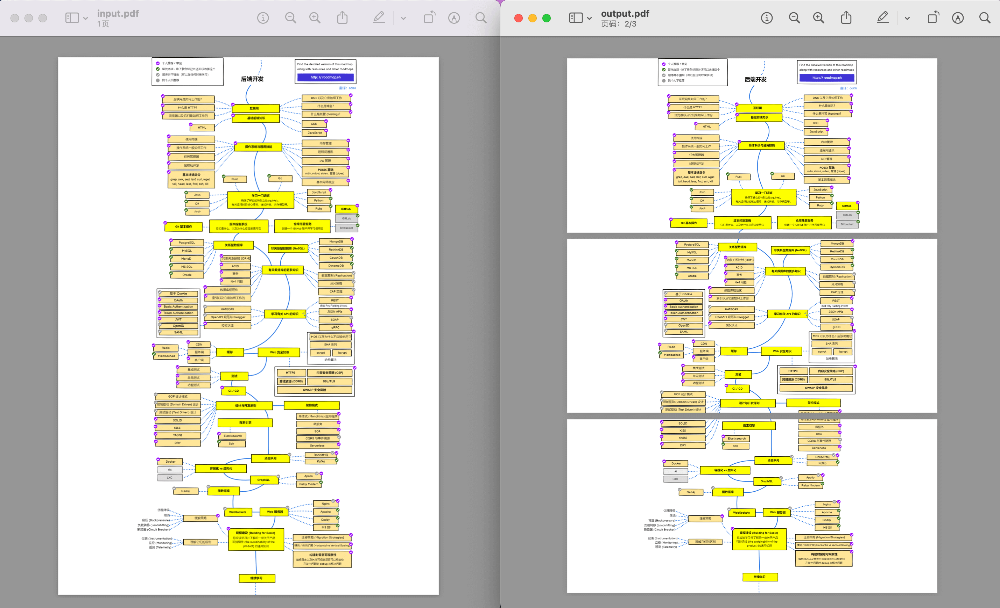

# PDF Crop

Crop a large pdf file into serveral smaller files suitable for A4 printing.

<p align="center">
  
</p>

## Usage

- modify `input.pdf`
- modify (x, y), which means split horizontally into 3 equal parts and divide vertically into 4 equal parts

```
$ python -m venv .venv
$ .venv/bin/pip install PyPDF2
$ .venv/bin/python main.py
```
